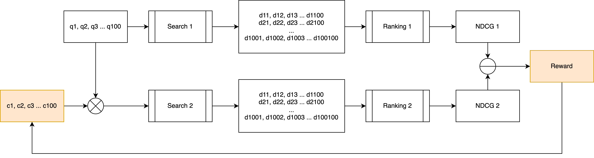
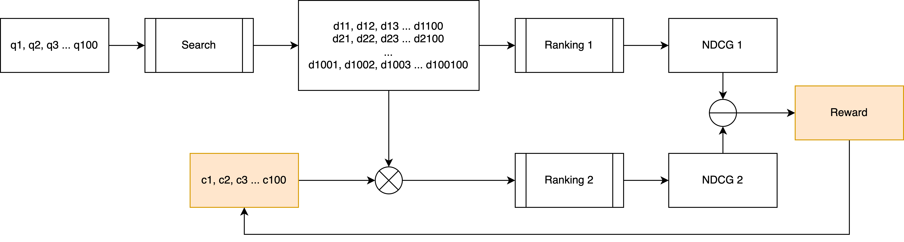

# Ранжирование поисковой выдачи с помощью многоруких бандитов

В данной работе исследуется применимость многоруких бандитов в задаче ранжирования поисковой выдачи.

## Идея
Применение бандитов для настройки коэффициентов векторов запроса или документов. Коэффициенты влияют на расстояние между векторами, меняя ранжирование, что, потенциально, может улучшить метрики.

## Компоненты системы
1. Обученная языковая модель для векторизации запросов
2. Обученный на векторах документов ANN-индекс для поиска кандидатов
3. В качестве предсказанной релевантности используется нормализованное расстояние до векторов
4. Многорукий бандит имеет 2 опции. Но параметры обучения общие - каждая ручка настривает коэффициент вдоль одной из осей вектороа запроса или векторов документов.

    4.1. Настройка коэффициентов вектора запроса. В этом случае в рамках расчета награды осуществляется новый поиск и расчет ndcg для новых кандидатов. Потенциальное преимущество такого подхода в том, что в тренировочных данных набор релевантных документов строго фиксирован, а так есть возможность менять набор кандидатов, улучшая метрику.

    

    4.2. Настройка коэффициентов векторов кандидатов. Поиск осуществляется только один раз и при новых итерациях для одного запроса набор документов не меняется. Но применение коэффициентов влият на расстояние до векторов и, соответсвенно, ранжирование.

    

## Результаты
Применимо к отдельным запросам (возможно, к группе близких запросов) обучение среды и применение коэффициентов дает преимущества - ранжирование улучшается.

В общем случае, при обучении на всех возможных запросах и документах, среда выучивает не применять коэффициенты, оставляя текущее ранжирование по-умолчанию.